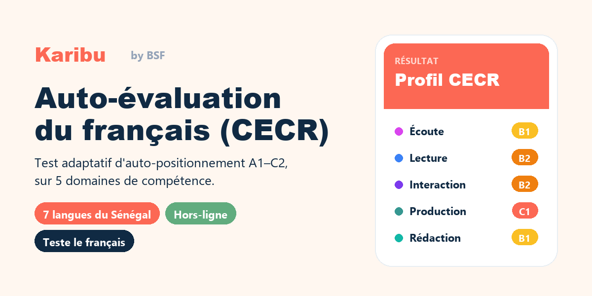

# Auto-évaluation du français (CECR)

Test adaptatif d'**auto-positionnement en français** selon le Cadre européen commun
de référence (**A1 → C2**), sur 5 domaines : écoute, lecture, interaction orale,
production orale et rédaction. Application **autonome**, sans dépendance, aux couleurs
**Karibu Hub / BSF**.

## ✨ Fonctionnalités

- 🎯 **Adaptatif** — 10 à 18 affirmations « Je peux… », niveau CECR par domaine.
- 🌍 **Multilingue** — interface et questions en **français, wolof, pulaar, seereer,
  mandinka, soninké, joola** (balant et saafi-saafi *bientôt disponibles*). Le test
  évalue **toujours le français** — seule la langue d'accompagnement change, ce qu'un
  bandeau rappelle en permanence.
- 👤 **Profil** — prénom, région (14 régions du Sénégal), tranche d'âge, genre.
- 📴 **Hors-ligne** — un seul fichier `index.html`, aucune installation.

## 🚀 Utilisation

- **En local / offline :** télécharger le site, extraire les fichiers et double-cliquer sur `index.html`.
- **En ligne (GitHub Pages) :** Cliquez ici https://ocaoimh.github.io/auto-eval-fr/ 

## ⚠️ Traductions en langues nationales à valider

Les textes en langues nationales (interface + 30 descripteurs) sont une **traduction
préliminaire automatique**, à faire relire par des locuteur·rice·s natif·ve·s avant
tout usage réel. Correction : l'objet `T` (interface) dans `index.html`, et
`questions.json` (descripteurs, réinjectés dans `index.html`).

## 📁 Contenu

| Fichier | Rôle |
|---|---|
| `index.html` | L'application complète (données + moteur + interface). |
| `karibu-theme.css` · `karibu-tokens.json` | Identité visuelle Karibu Hub (réutilisable). |
| `questions.json` | Les 30 descripteurs (7 langues). |
| `.nojekyll` | Pour un déploiement GitHub Pages propre. |
| `GUIDE.md` | Documentation détaillée. |

## 📝 Crédits

Descripteurs CECR et algorithme d'après l'outil « Auto-évaluez vos capacités
linguistiques » de la [Journée européenne des langues](https://edl.ecml.at/)
(CELV / Conseil de l'Europe). Descripteurs CECR © Conseil de l'Europe.
Identité visuelle : Karibu Hub / Bibliothèques Sans Frontières.
